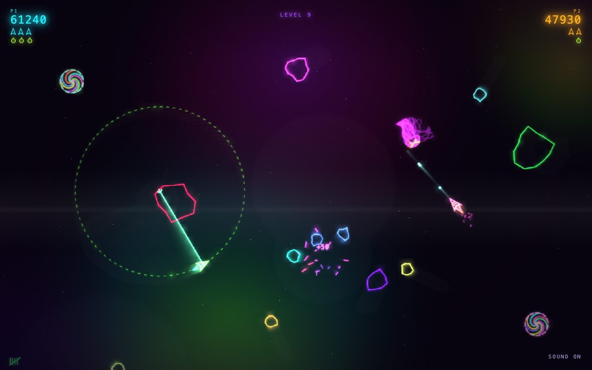
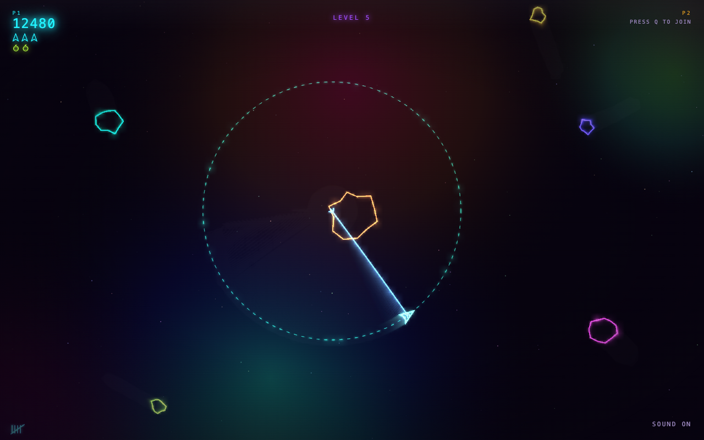
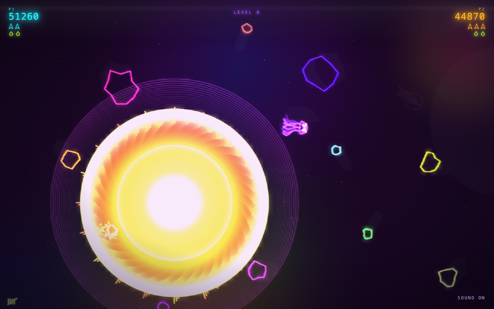
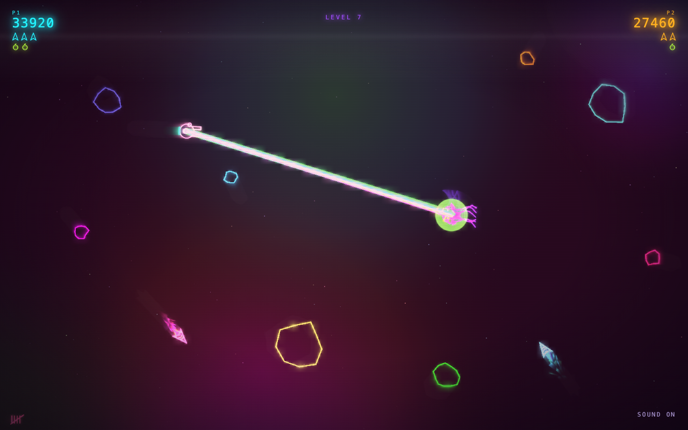
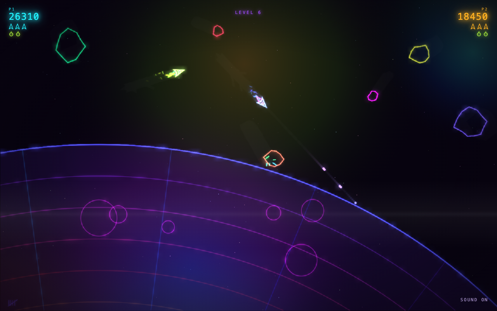
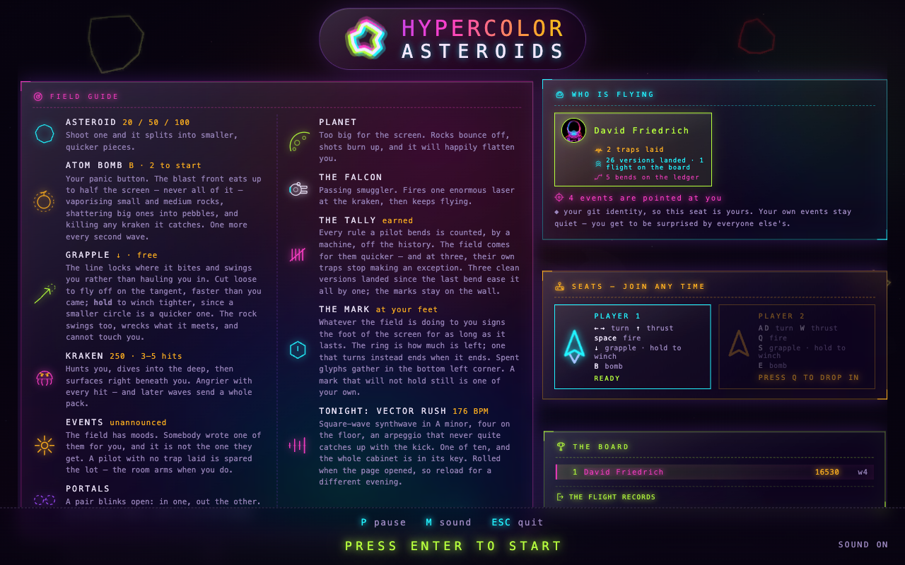

# HYPERCOLOR ASTEROIDS

A neon vector rewrite of the 1979 arcade game. Canvas graphics, Web Audio music,
hand written HTML, CSS and JavaScript. No build step, no dependencies, no
network.

It is two games in one. On the screen: rocks, portals, a kraken. In the repo: a
slow multiplayer game between the developers who share it. The git history is
the save file, the commit log is the leaderboard, and nobody has to be online
at the same time. That half is explained in
[The game behind the game](#the-game-behind-the-game) — you can also ignore it
and just fly.

Open `index.html` in a browser and it plays. Two pilots, one screen; player two
can drop in mid-wave, and anyone out of lives can buy back in. What you need to
play and to build — including what a Windows machine needs — is in
[docs/requirements.md](docs/requirements.md).



## What's out there

- **Asteroid** — 20 / 50 / 100 points, splits into smaller, quicker pieces.
- **Atom bomb** — the panic button. Eats half the screen. Two to start, one more
  each wave.
- **Grapple** — the line locks where it bites and swings you rather than hauling
  you in. Cut loose to fly off on the tangent, faster than you came. The rock
  swings too, and wrecks whatever it meets.
- **Kraken** — 250 points, 3–5 hits. Dives, then surfaces right beneath you.
  Angrier with every hit.
- **Portals** — fly in one and out the other. So can your shots, and the kraken.
- **Planet** — too big for the screen, and happy to flatten you.
- **The Falcon** — passing smuggler, one enormous laser, then gone.
- **The black box** — every flight is taped, and the tape is a scoreboard entry.









## How it's put together

Every feature is one module that registers itself with the game loop. Adding one
is a new file plus a line in the manifest; nothing else mentions it. The HUD,
the seat cards and the field guide are generated from the same registry, so two
people adding two features never edit the same lines.

**[docs/ARCHITECTURE.md](docs/ARCHITECTURE.md) is the map.**

---

## The game behind the game

The repo is not just where the game is stored — it is where the game is played.
It works like this:

**Commits are turns.** A commit that touches `index.html`, `src/` or `styles/`
gets a version number, counted off the git history by a script; docs and tools
do not. Nobody announces what they built. You commit it, the next person pulls,
presses ENTER, and finds out by playing. Reading the diff first is like shaking
the presents.



**Traps connect the players.** An event is a surprise dropped into a live wave,
each in its own file under `src/events/`, and one rule makes it worth doing:

> **Your own trap never fires for you.**

**Playing counts.** Every flight is taped, the tape carries a checksum, and an
edited one ranks nowhere. Honest ones land in
[docs/RANKINGS.md](docs/RANKINGS.md).

**The rules are part of the game.** [GOLDEN_RULES.md](GOLDEN_RULES.md) is the
whole rulebook. *Red lines* are hard stops. *Budgets* you may spend, but only
in writing, in the commit, under your own name. *Nudges* just get mentioned.
Changing a rule is allowed too, in its own commit, in the open.

**Bending rules has a price.** Overrides are counted from the history into a
ledger nobody may edit by hand, and the game reads your number: 1 bend and
ambushes come sooner, 3 and your own traps stop sparing you, 4 and a wave may
hold an extra ambush. Skipping the hooks costs two instead of one. Nothing
blocks you and nobody shames you — your game just gets harder, in public.

**A referee at the keyboard.** `tools/golden-check.sh` checks the rules on
every commit, and [CLAUDE.md](CLAUDE.md) makes claude a second one: it enforces
the rulebook and refuses the shortcuts.

**The book.** After every commit a script rewrites the chronicle —
[docs/index.html](docs/index.html) is the cover, one page per version behind
it. Put a `Chronicle:` line in your commit and the book quotes you.

## Joining in

You take your turn by talking to claude in this folder. A whole session looks
like this:

- *"what did the others land since I last played?"* — or `/scout`
- *"add comets, and make them come in threes"*
- *"a trap that flips everyone's controls for ten seconds"* — or `/event`
- *"the kraken is too easy now"*
- *"read the black box"* — paste the tape off the game-over screen
- *"land it"* — or `/land`

That is the job. Claude puts each thing in its own file, wires it in, checks
the rules, hands the game back for you to play, and writes the commit. You do
not need to know how any of it works.

Set up once, in a terminal:

```sh
git clone <this repo>
tools/golden-check.sh --install   # wire in the referee
tools/whoami.sh                   # say who you are
open index.html                   # find out what the others did to you
claude                            # and take your turn
```

Two things worth knowing:

- Claude will refuse some things — another player's trap file, skipping the
  referee, editing your own tally. That is the game working, not a bug.
- Bending a rule is allowed. It costs one line in the commit, and your game
  gets harder in public. [GOLDEN_RULES.md](GOLDEN_RULES.md) is one page if you
  are curious.

Arriving from outside, with a pull request rather than a push, works the same
way and is read the same way — one commit at a time, each judged as its own
author. [CONTRIBUTING.md](CONTRIBUTING.md) is the walk-through, and
`tools/inbound.sh` tells you what the referee will say before you send it.

Nobody has to trust anybody. `git blame` says who made a thing, the book says
who bent which rule, and the ledger is computed from both. That is all the
governance a game about shooting rocks needs.

Now go and do something to annoy the others.
