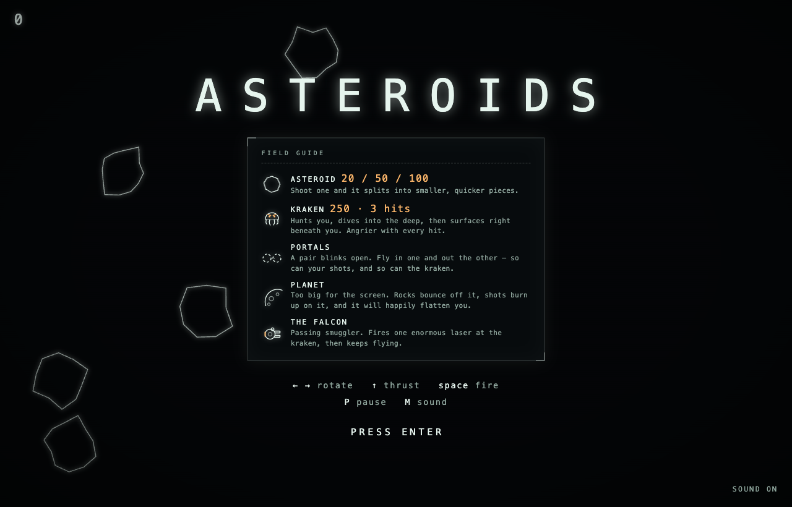

# ASTEROIDS // HYPERCOLOR

A neon vector rewrite of the 1979 arcade game. No build step, no dependencies,
no network — the graphics are canvas, the music is synthesised in the Web Audio
API at runtime, and the whole thing is hand written HTML, CSS and JavaScript.

This repository is two things. The first half of this README is the game. The
second half is the game the developers here play on each other. If you just
cloned this and something ambushed you that was not in the code yesterday, the
second half explains it.


## Part one — the game

### Play

Open `index.html` in a browser. That's it.

Some browsers are fussy about `file://` for local pages, so if it misbehaves,
serve it:

```sh
python3 -m http.server 8000
# then open http://localhost:8000
```

### Controls

Two pilots, one screen. Player two can drop in mid-wave, and anyone out of
lives can buy back in — joining is never refused.

| | Player 1 | Player 2 |
|---|---|---|
| Turn | `←` `→` | `A` `D` |
| Thrust | `↑` | `W` |
| Fire | `space` | `Q` |
| Grapple (hold to winch) | `↓` | `S` |
| Atom bomb | `B` | `E` |

`P` pauses, `M` toggles sound.

### What's out there

- **Asteroid** — 20 / 50 / 100 points. Shoot one and it splits into smaller,
  quicker pieces.
- **Atom bomb** — the panic button. The blast front eats half the screen,
  vaporising every rock it touches and gutting any kraken. Two to start, one
  more each wave.
- **Grapple** — the line locks where it bites and never hauls you in, it
  *swings* you. Arc round a rock and cut loose to fly off on the tangent,
  faster than you came. Hold to winch tighter — a smaller circle is a quicker
  one. The rock swings too, and wrecks whatever it meets.
- **Kraken** — 250 points, 3–5 hits. Hunts you, dives into the deep, then
  surfaces right beneath you. Angrier with every hit, and later waves send a
  whole pack.
- **Portals** — a pair blinks open. Fly in one and out the other. So can your
  shots, and so can the kraken.
- **Planet** — too big for the screen. Rocks bounce off it, shots burn up on
  it, and it will happily flatten you.
- **The Falcon** — passing smuggler. Fires one enormous laser at the kraken,
  then keeps flying.
- **The black box** — every flight is taped. When the last ship dies, the
  game-over screen offers the tape with a copy button. What the tape is for is
  part two's business.



### How it's put together

Every feature — each kind of entity, each effect, each rule — is one module
that registers itself with the game loop. Adding one is a new file plus a
single line in the manifest; nothing else in the codebase mentions it. The
HUD, the seat cards and the field guide on the splash screen are all generated
from that same registry, so they cannot drift from the code and two people
adding two features never edit the same lines.

**[docs/ARCHITECTURE.md](docs/ARCHITECTURE.md) is the map** — where things
live, what the frame does, and how to add a feature.

- **Rendering** — entities draw to an offscreen layer that is faded rather than
  cleared, so everything that moves leaves a phosphor trail. That layer is
  downscaled twice and scaled back up for a cheap bloom, then composited under
  a CRT vignette, scanlines and a rolling refresh bar.
- **Audio** — one shared Web Audio graph. A four section song in E minor
  (main theme, chase, half time breakdown, lift) is sequenced sixteenth by
  sixteenth at 168 BPM over synthesised guitar, harmonised lead, bass and
  drums. Sound effects are one shots on the same graph — the blaster is an
  FM'd saw diving four octaves through a resonant bandpass into a feedback
  delay, so it screams off into the distance.
- **Input** — keyboard for both seats, plus on screen buttons that appear only
  when a touch device is detected.

---

## Part two — the game behind the game

Plain words, because this is the part that confuses people.

**Several developers share this game.** We all commit to the same repo, and we
play by one rule: you do not announce what you built. You commit it, the next
person pulls, presses ENTER, and finds out by playing. The surprise is the
whole point. Reading the diff first is like shaking the presents.

**Every change to the game is a numbered version.** A commit that touches
`index.html`, `src/` or `styles/` is a version — v1, v2, v3, counted straight
off the git history by a script. Nobody assigns the numbers and nobody can
skip one. Commits that only touch docs or tools are not versions: the game did
not change, so there is nothing to discover.

**The book.** After every commit, a script rewrites the chronicle —
[docs/index.html](docs/index.html) is the cover, one page per version behind
it. It is written from the commit messages: put a `Chronicle:` line in yours
and the book quotes you. Each version also gets one dry `Tagline:` line, kept
forever in `docs/taglines.tsv`. Write your own or the machine writes one.

**There are twelve rules, and a script enforces them.**
[GOLDEN_RULES.md](GOLDEN_RULES.md) is the whole rulebook and it is short. The
referee is `tools/golden-check.sh`, and the git hooks run it on every commit.
Wire it up once per clone:

```sh
tools/golden-check.sh --install
```

The rules come in weights, and the weights are the trick:

- **Red lines** — hard stops, no exceptions for anyone. Do not break the game,
  do not add dependencies, do not rewrite history, do not touch another
  pilot's traps.
- **Budgets** — soft limits. You may go past one, but you must say so in the
  commit message: `Golden-Rule-Override: GR4 - <why>`. The commit lands, and
  that line stays in the history forever, under your name.
- **Nudges** — the referee mentions it and gets out of your way.

**Bending rules has a price, and the game itself collects it.** Every override
is counted — by a script, from the git history, into a ledger nobody may edit
by hand. The game reads your number when you play:

- 1 bend or more — ambushes come for you sooner.
- 3 bends — your own traps stop sparing you (see events, below).
- 4 bends — a wave may hold one extra ambush.

Going around the hooks does not help. The commit still lands, and it costs two
instead of one, because a rule bent quietly is worse than a rule bent in the
open. Nothing blocks you and nobody shames you. Your game just gets a little
harder, and everyone can see why.

**Events are traps we lay for each other.** Anyone may write an ambush — three
krakens at once, a ring of rock closing in — in their own file under
`src/events/`. One rule makes it worth doing:

> **Your own trap never fires for you.**

Everybody else gets it. You never do. That is why the splash screen asks who
is flying before it lets you in. Lock your seat once and it stops asking:

```sh
tools/whoami.sh
```

Nobody may edit your event file, ever, and nobody may sign an event with your
name. This one has no override at all.

**The black box is the scoreboard.** When your flight ends, copy the tape off
the game-over screen, paste it to claude in this repo and say *read the black
box*. The tape carries a checksum, so an edited tape is caught and ranks
nowhere. Honest flights land in [docs/RANKINGS.md](docs/RANKINGS.md).

**How to join in:**

```sh
git clone <this repo>
tools/golden-check.sh --install   # wire in the referee, once
tools/whoami.sh                   # lock your seat
open index.html                   # find out what the others did to you
```

Then build something — one new file, one line in `src/features.js` — play it,
and commit it with a subject line the next pilot will enjoy. If you work with
Claude Code, [CLAUDE.md](CLAUDE.md) makes claude the referee at your keyboard,
and there are skills for the ritual: `/scout` before you build, `/event` to
lay a trap, `/land` to commit, `/blackbox` to file a flight, `/fairplay` to
check the standings.

Nobody here has to trust anybody. `git blame` says who made a thing. The book
says who bent which rule. The ledger is computed from both, and nobody can
write their own. That is all the governance a game about shooting rocks needs.

Now go and do something to annoy the others.
